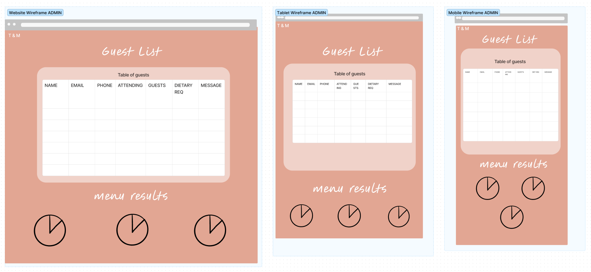
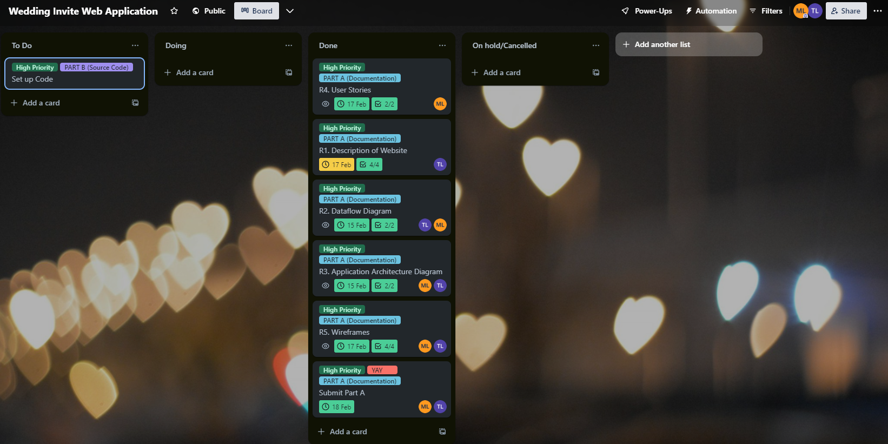

# T3A2 Full Stack Web Application: Wedding Invitation <!-- omit from toc -->
By Michelle Liang and Timothy Lin

## Links <!-- omit from toc -->
[Github Repo](https://github.com/mcelle888/FinalProject)

[Trello Board](https://trello.com/b/PjIrUOOm/wedding-invite-web-application)

## Table of Contents <!-- omit from toc -->
- [R1. Webapp Overview](#r1-webapp-overview)
  - [Description](#description)
  - [Purpose](#purpose)
  - [Functionality / features](#functionality--features)
  - [Target audience](#target-audience)
  - [Tech stack](#tech-stack)
- [R2. Dataflow Diagram](#r2-dataflow-diagram)
- [R3. Application Architecture Diagram](#r3-application-architecture-diagram)
- [R4. User Stories](#r4-user-stories)
- [R5. Wireframes](#r5-wireframes)
  - [Welcome Page Wireframes](#welcome-page-wireframes)
  - [Home Page Wireframes](#home-page-wireframes)
  - [Details Page Wireframes](#details-page-wireframes)
  - [About Page Wireframes](#about-page-wireframes)
  - [Menu Page Wireframes](#menu-page-wireframes)
  - [RSVP Page Wireframes](#rsvp-page-wireframes)
  - [Admin Page Wireframes](#admin-page-wireframes)
- [R6. Trello Board](#r6-trello-board)

## R1. Webapp Overview
### Description
Our website is crafted to simplify the process of inviting friends and family to weddings. It provides a smooth platform for hosts to manage their guest list and send out invitations digitally, offering guests a hassle-free RSVP option. 

### Purpose
The aim of the website is to modernise wedding invitations and provide a cost-effective alternative to traditional methods through digital invites. This eliminates the use of paper invitations and RSVP cards, making the process more efficient and environmentally friendly. The app enhances communication between hosts and guests, ensuring important event details are easily accessible and readily available. Interactions are instant and users have the endless personalisation options. 

### Functionality / features

1. User Authentication: Users and admins log in via a simple pin code.
2. RSVP System: Simple RSVP process for guests, allowing guests to provide some basic information (name, email, phone), indicate their attendance status and provides an additional section for information such as dietary requirements, extra guests and questions.
3. Guest List Management: Admins can view, filter and sort through the guest list responses.
4. Dedicated section for event specifics, such as venue, date, and time for all the essential details.
5. ‘About Us’ page to introduce and showcase the couple’s history and background.
6. Menu voting feature to let the guests vote on their food for the night
 7. Responsive Design: Ensures accessibility and usability across various devices.

### Target audience
Our website caters to couples planning weddings to seek an efficient way to manage their guest list and send digital invitations. It also serves guests who receive these invitations and require a convenient platform for RSVPs and accessing event details.

### Tech stack

### Frontend <!-- omit from toc -->
**React**.js: User interface development library 

**HTML**/CSS: Standard web markup and styling

### Backend: <!-- omit from toc -->
**Node.js**: Server-side JavaScript runtime

**Express.js**: Web application framework for Node.js

**MongoDB**: NoSQL database for storing user and event data

**Mongoose**: MongoDB object modelling tool

### Deployment <!-- omit from toc -->

MongoDB

Netlify

Render

**Other:**

**Git**: Version control system for collaboration

## R2. Dataflow Diagram

## R3. Application Architecture Diagram 

## R4. User Stories

User stories capture the purpose of an application by describing the requirements and expectations that users have when using the application. User needs are presented in a simple and informal manner to clearly drive development in the planning phase of a project. In this project, the user stories below assist in defining and prioritizing the key functionalities the target audience (couples and guests) require when managing and responding to wedding invitations. 

**Admin (Couple)**

As an admin I would like to be able to share wedding details with my guests (Date, Time, Location, Menu)

As an admin I would like to be able to update these details if needed. 

As an admin I would like to be able to view the guest lists RSVP responses 

As an admin I would like to be able to filter and sort the guest list by who is coming, who has declined and who has not responded. 

As an admin I would like to view the status of the menu voting (additional feature)

**Users (Guests):**

As a guest I would like to view details about the wedding (Date, Venue, Time, Menu) 

As a guest I would like to respond to the couples RSVP

As a guest I would like to be able to add additional guests to my RSVP (e.g. children)

As a guest I would like to update my RSVP response if circumstances change

As a guest I would like to vote on the menu items (additional feature) 

As a guest I would like to be able to communicate dietary requirements or any questions I have about the invitation to the admins(couple). 

## R5. Wireframes

### Welcome Page Wireframes

The welcome page uses two pictures to create the background. Guests are welcomed with a 'We're getting married' text to keep the message clear and simple. Users are then asked to login with a 4-digit pin provided by the couple. The design across all three viewports are relatively the same however due to the narrow width of a mobile device, the two background images are positioned above each other rather than beside to ensure the whole images are seen. 

### Home Page Wireframes

The home page is the first page the user is redirected to after logging in with their pin. It is the simplest page of the site, featuring a navigation bar on the top right which is centered in the mobile view due to limited width space. This is featured on all the pages except the welcome page. The couples name is centered in all viewports with the most important details (time, date and location) displayed below. Finally, an RSVP button is displayed under in a gold box to highlight the main feature of this application. The button will enlarge when hovered to engage and again highlight the importance of the button. Clicking will redirect the user to the RSVP page. All viewports an identical setup due to the simplicity of the page. 

### Details Page Wireframes

The details page is divided into two large sections: the 'when & where' section (featuring a map feature of the location) and the 'itinerary' section. The wider screen in PC view allows for these sections to be placed side by side. In the tablet view the sections are still side by side but rearranged and finally the mobile view has the sections flowing downwards. 

### About Page Wireframes

The about us page features the history of the couple in the form of a timeline. The timeline runs horizontally across the PC and tablet vies whilst changing to a vertical format in the mobile view. The page will feature short descriptions at each timestamp/milestone aswell as corresponding photos to visually enhance the page. 

### Menu Page Wireframes

The menu page features three sections for each meal (entree, main, dessert). There are two options for each of these three meals for guests to vote on and they can do so by clicking onto the corresponding image of the dish they prefer. Once a selection has been made, guests can hit the golden 'submit' button. In the PC viewport, each section is displayed horizontally whilst in the tablet view, each section is laid out vertically and minimised slightly. Finally the mobile view is again postioned the sections vertically down the page due to limited space. 

### RSVP Page Wireframes

The RSVP page features a form for users to fill. Users will be required to present their Full name, email, phone, attendance and can additionally provide extra guest names, dietary requirements and questions/messages. These will be saved and sent to the database once the user hits the golden submit button at the end of the form. 

### Admin Page Wireframes

The admin page is only accessible by the admins (couple). This page is accessible via an 8-digit pin when entered in the welcome page. The page features all the data saved from the RSVP form and is displayed in a neat table for the couple to manage. The data from the menu voting is collected and used to make pie charts for each respective meal (one for entree, one for main, etc) which gives the couple an quick and simple overview of the menu voting. 

## R6. Trello Board

Trello was the chosen development tool for this project. It provides a visual collaborative platform to organise and manage tasks to ensure timely progress. For our project, cards were moved across three primary sections: 'To do, 'Doing' and 'Done' which helped track progression. Team members are allocated cards to organise and direct workflow and cards all have checklists and due dates to ensure deadlines are met. This also provides real time updates on tasks as well as facilating transparency and accountablity for all team members. Priority labels are also used to further assist in time management which ensures that the most important features and tasks are completed. 

### Day 1 Screenshot <!-- omit from toc -->

### Day 2 Screenshot <!-- omit from toc -->

### Day 3 Screenshot <!-- omit from toc -->

### Day 4 Screenshot <!-- omit from toc -->
